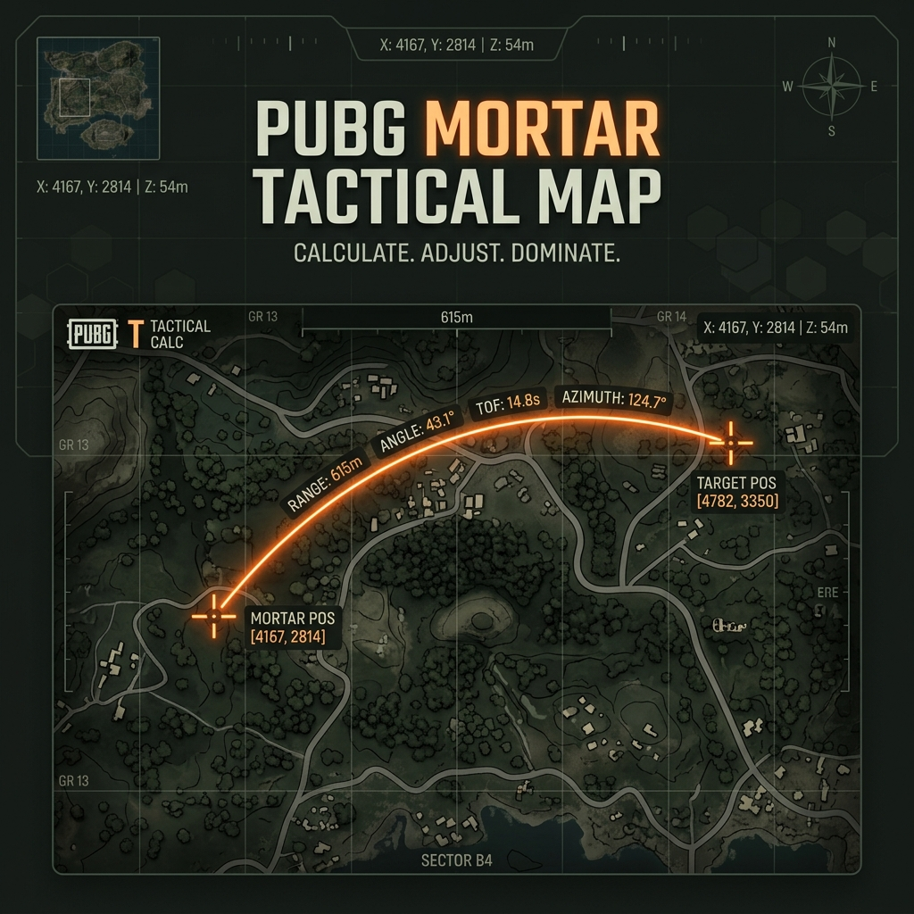

<p align="center">
  
</p>

<h1 align="center">🎯 PUBG Mortar Tactical Map</h1>

<p align="center">
  <strong>Calculadora táctica de morteros y herramienta de medición para PUBG</strong><br/>
  <em>Tactical mortar calculator & measurement tool for PUBG</em>
</p>

<p align="center">
  <a href="https://skuuill.github.io/PUBG-Mortar-Tactical-Map/">
    
  </a>
  
  
  
</p>

<p align="center">
  
  
  
  
</p>

---

## 📋 Tabla de Contenidos

- [Qué es](#-qué-es)
- [Características](#-características)
- [Demo en vivo](#-demo-en-vivo)
- [Mapas soportados](#️-mapas-soportados)
- [Cómo usar](#-cómo-usar)
- [Atajos de teclado](#️-atajos-de-teclado)
- [Arquitectura](#-arquitectura)
- [Ejecución local](#-ejecución-local)
- [Stack tecnológico](#-stack-tecnológico)
- [Contribuir](#-contribuir)
- [Licencia](#-licencia)

---

## 🔭 Qué es

**PUBG Mortar Tactical Map** es una aplicación web táctica diseñada para jugadores de PUBG que necesitan:

- 📏 **Medir distancias** entre dos puntos sobre el mapa de forma precisa
- 💣 **Calcular tiros de mortero** con ángulo, distancia efectiva y tiempo de vuelo
- ✏️ **Dibujar tácticas** directamente sobre los mapas interactivos
- 📤 **Compartir configuraciones** mediante URL con un clic
- 📱 **Instalarla como app nativa** en cualquier dispositivo (PWA)

> Todo en una sola pantalla, sin depender de herramientas separadas ni tablas de referencia externas.

---

## ✨ Características

<table>
  <tr>
    <td align="center" width="33%">
      <h3>📏 Medición de Distancia</h3>
      <p>Marca dos puntos en el mapa y obtén la distancia exacta en metros al instante.</p>
    </td>
    <td align="center" width="33%">
      <h3>💣 Calculadora de Mortero</h3>
      <p>Distancia, ángulo de tiro, tiempo de vuelo y validación de alcance (121m — 700m).</p>
    </td>
    <td align="center" width="33%">
      <h3>🏔️ Corrección por Elevación</h3>
      <p>Ajusta la distancia del mortero compensando diferencias de altura entre posiciones.</p>
    </td>
  </tr>
  <tr>
    <td align="center" width="33%">
      <h3>✏️ Dibujo Táctico</h3>
      <p>Trazado libre, líneas, círculos, rectángulos, texto y borrador con 6 colores.</p>
    </td>
    <td align="center" width="33%">
      <h3>📤 Compartir & Exportar</h3>
      <p>Genera URLs con tu config actual o exporta la vista del mapa como PNG.</p>
    </td>
    <td align="center" width="33%">
      <h3>📱 PWA Instalable</h3>
      <p>Instala la app en tu dispositivo y úsala offline como una app nativa.</p>
    </td>
  </tr>
  <tr>
    <td align="center" width="33%">
      <h3>🌙 Tema Claro / Oscuro</h3>
      <p>Interfaz adaptada a tu preferencia visual con persistencia automática.</p>
    </td>
    <td align="center" width="33%">
      <h3>⌨️ Atajos de Teclado</h3>
      <p>Acceso rápido a todas las funciones sin tocar el mouse.</p>
    </td>
    <td align="center" width="33%">
      <h3>📊 HUD Táctico</h3>
      <p>Panel de resultados siempre visible con todos los datos del disparo actual.</p>
    </td>
  </tr>
</table>

---

## 🌐 Demo en vivo

**➡️ [skuuill.github.io/PUBG-Mortar-Tactical-Map](https://skuuill.github.io/PUBG-Mortar-Tactical-Map/)**

Compatible con **escritorio** y **móvil**. Diseño responsive optimizado para partidas rápidas.

---

## 🗺️ Mapas soportados

| Mapa | Tipo | Tamaño | Descripción |
|------|------|--------|-------------|
| 🏝️ **Erangel** | Clásico | 8×8 km | Mapa principal original |
| 🏜️ **Miramar** | Desértico | 8×8 km | Desierto y terreno abierto |
| ❄️ **Vikendi** | Nevado | 8×8 km | Nieve y montañas (Reborn) |
| 🏯 **Taego** | Coreano | 8×8 km | Paisajes coreanos |
| 🏙️ **Deston** | Urbano | 8×8 km | Ciudades y zonas urbanas |
| 🌄 **Rondo** | Tradicional | 8×8 km | Mapa clásico |

---

## 🚀 Cómo usar

### Modo Distancia

```
1. Seleccioná el mapa en el que estás jugando
2. Hacé clic en el mapa → punto INICIAL
3. Hacé clic nuevamente → punto FINAL
4. El HUD muestra la distancia automáticamente
```

### Modo Mortero

```
1. Activá el modo Mortero desde el panel "Tiro"
2. Hacé clic en el mapa → posición del MORTERO
3. Hacé clic nuevamente → posición del OBJETIVO
4. El HUD muestra: distancia, ángulo, tiempo de vuelo y estado
```

### Corrección por Elevación (Opcional)

```
1. En modo Mortero, ingresá la diferencia de altura en metros
2. Valores positivos = objetivo MÁS ARRIBA que el mortero
3. Valores negativos = objetivo MÁS ABAJO que el mortero
4. La distancia efectiva se ajusta automáticamente
```

### Dibujo Táctico

```
1. Abrí la sección "Dibujo" → "Abrir herramientas"
2. Elegí herramienta: trazado, línea, círculo, rectángulo, texto o borrador
3. Elegí un color de los 6 disponibles
4. Dibujá directamente sobre el mapa
```

---

## ⌨️ Atajos de teclado

| Tecla | Acción |
|-------|--------|
| `R` | Reiniciar medición y encuadre |
| `C` | Limpiar medición actual |
| `D` | Abrir/cerrar panel de dibujo |
| `H` | Abrir ayuda rápida |
| `M` | Alternar modo mortero |
| `S` | Compartir configuración |
| `E` | Exportar vista como PNG |
| `I` | Instalar como PWA |
| `Esc` | Cerrar paneles abiertos |

---

## 🏗️ Arquitectura

```
📁 PUBG-Mortar-Tactical-Map/
│
├── 📄 index.html                        # Shell principal de la interfaz
├── 📄 manifest.webmanifest              # Configuración PWA
├── 📄 sw.js                             # Service Worker (cache offline)
│
├── 📁 src/
│   ├── 📁 js/
│   │   ├── 📄 main.js                   # Entry point modular
│   │   ├── 📁 config/
│   │   │   ├── 📄 maps.js               # Configuración de mapas (bounds, rutas)
│   │   │   └── 📄 mortar.js             # Balística del mortero (ángulos, rangos)
│   │   ├── 📁 core/
│   │   │   └── 📄 pubg-mortar-app.js    # Coordinación de mapa, HUD y estado
│   │   ├── 📁 features/
│   │   │   ├── 📄 drawing-manager.js    # Capa de dibujo táctico (Leaflet)
│   │   │   └── 📄 export-service.js     # Exportar mapa a PNG (html2canvas)
│   │   └── 📁 services/
│   │       ├── 📄 theme-service.js      # Toggle tema claro/oscuro
│   │       ├── 📄 share-service.js      # Compartir por URL
│   │       ├── 📄 pwa-service.js        # Registro SW + instalación
│   │       └── 📄 visitor-counter-service.js  # Contador de visitas
│   │
│   └── 📁 styles/
│       ├── 📄 main.css                  # Imports centralizados
│       ├── 📄 tokens.css                # Design tokens (colores, spacing)
│       ├── 📄 base.css                  # Reset y tipografía base
│       ├── 📄 layout.css               # Grid y estructura responsive
│       ├── 📄 components.css            # Componentes UI (botones, cards, HUD)
│       └── 📄 map.css                   # Estilos específicos del mapa Leaflet
│
├── 📁 assets/
│   ├── 📁 branding/                     # Íconos, favicons, banner social
│   └── 📁 maps/
│       ├── 📁 active/                   # Mapas actuales (PNG de alta resolución)
│       ├── 📁 archive/                  # Mapas descontinuados
│       └── 📁 tiles/                    # Tiles pre-procesados (si aplica)
│
├── 📁 vendor/
│   └── 📁 leaflet/                      # Leaflet.js (bundle local)
│
└── 📁 .github/
    └── 📁 workflows/
        └── 📄 deploy-pages.yml          # CI/CD → GitHub Pages
```

---

## 💻 Ejecución local

### Requisitos previos

- Un navegador moderno (Chrome, Firefox, Edge, Safari)
- Opcionalmente, un servidor HTTP local para probar PWA y caché

### Opción rápida

Abrí `index.html` directamente en el navegador.

### Con servidor local (recomendado)

```bash
# Con Python
python -m http.server 8080

# Con Node.js
npx serve .

# Con PHP
php -S localhost:8080
```

> **Nota:** Para que el Service Worker y la funcionalidad PWA se registren correctamente, se necesita servir desde `http://localhost` o `https://`.

---

## 🛠️ Stack tecnológico

| Tecnología | Uso |
|------------|-----|
| **HTML5** | Estructura semántica y accesibilidad (ARIA) |
| **CSS3** | Design tokens, layout responsive, tema dual |
| **JavaScript ES Modules** | Lógica modular sin bundler |
| **Leaflet.js** | Motor de mapas interactivos |
| **html2canvas** | Exportación de vistas a PNG |
| **Service Worker** | Cache offline y soporte PWA |
| **GitHub Pages** | Hosting y deploy automático |

---

## 🤝 Contribuir

¡Las contribuciones son bienvenidas! Si querés mejorar la app:

1. **Forkeá** el repositorio
2. Creá una rama: `git checkout -b feature/mi-mejora`
3. Hacé tus cambios y commit: `git commit -m "feat: agregar nueva funcionalidad"`
4. Push a tu rama: `git push origin feature/mi-mejora`
5. Abrí un **Pull Request**

### Ideas para contribuir

- 🗺️ Agregar nuevos mapas
- 🎨 Mejorar herramientas de dibujo
- 🌍 Traducciones a más idiomas
- 📊 Nuevas métricas en el HUD
- 🐛 Reportar bugs

---

## 📄 Licencia

Este proyecto está bajo la licencia **MIT**. Podés usarlo, modificarlo y distribuirlo libremente.

---

<p align="center">
  <sub>Hecho con ❤️ para la comunidad de PUBG</sub><br/>
  <sub>
    <a href="https://skuuill.github.io/PUBG-Mortar-Tactical-Map/">Demo en vivo</a> •
    <a href="https://github.com/SkuuIll/PUBG-Mortar-Tactical-Map/issues">Reportar bug</a> •
    <a href="https://github.com/SkuuIll/PUBG-Mortar-Tactical-Map/issues">Solicitar feature</a>
  </sub>
</p>
